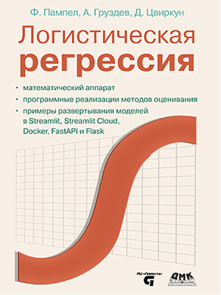

# Программный код к книге "Логистическая регрессия"

Этот репозиторий содержит программный код к книге "Логистическая регрессия" Фреда Пампела, Артема Груздева и Дмитрия Цвиркуна.
Детальную информацию о книге вы можете найти на [веб-сайте издательства "ДМК-Пресс"](https://dmkpress.com/catalog/computer/mathematics/978-5-93700-213-6/).

Книга требует последние версии scikit-learn, pandas, NumPy, SciPy.

## Опечатки
Всю информацию по опечаткам отправляйте на [электронную почту](mailto:info@gewissta.ru). Если есть проблемы с кодом, пользуйтесь кнопкой [New Issue](https://github.com/Gewissta/Logistic_Regression/issues/new/choose) раздела Issues.

## Список найденных опечаток:

## Список исправлений программного кода:

